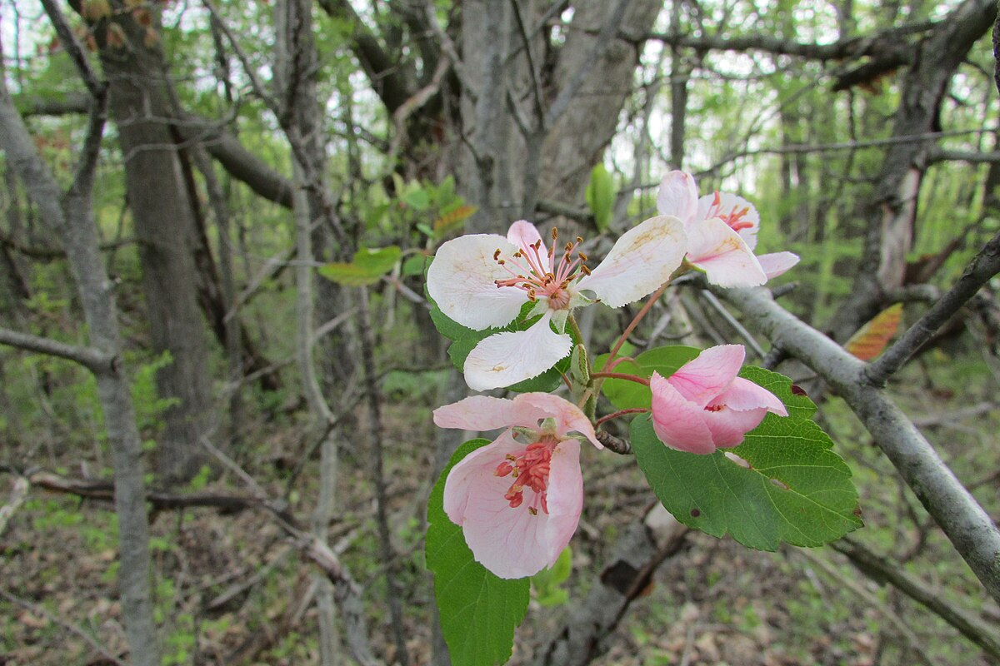
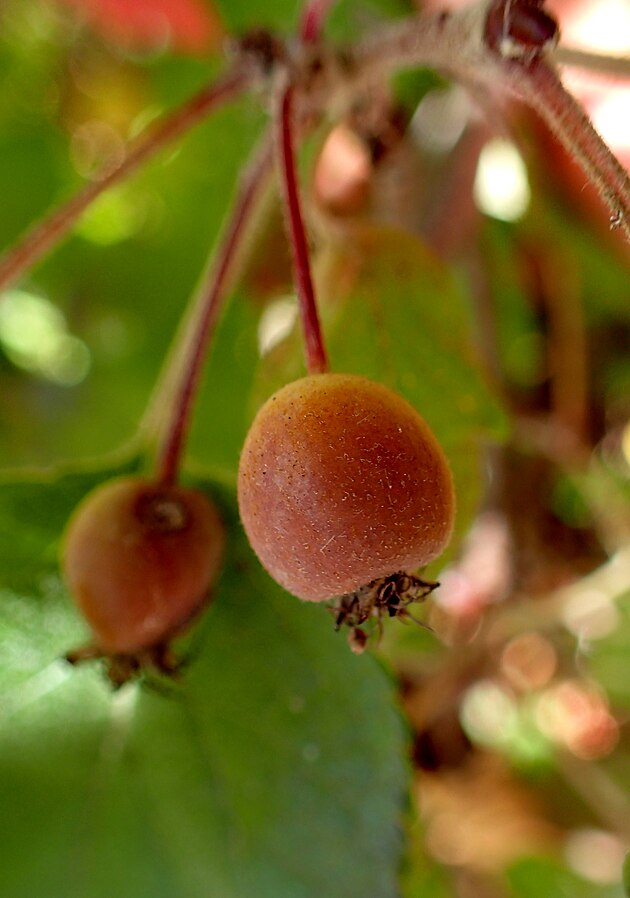

### About

This shiny app was developed and is maintained by Jens Ulrich (jensj27[at]mail.ubc.ca). This app accompanies a peer-reviewed article focusing on [the conservation and sustainable use of Canadian wild apple relatives](). The app was developed using research outputs and feedback provided by the article authors.

### Additional resources

Canada contains a rich diversity of CWR (wild relatives of crops), including relatives of diverse food plants such as apple, blueberry and cranberry, grape, raspberry and blackberry, saskatoon berry, sunflower and walnut. These CWR species have the potential to improve our crop species. For example, breeding with CWR can introduce adaptive traits that offer resistance against pests, disease, or harsh environmental conditions. Many woody CWR can also be used as rootstock. 

To explore the full diversity of Canadian CWR, please check out our other [web application](https://julrich.shinyapps.io/CWR_app/) or peer-reviewed articles including [Ulrich et al. 2022](https://acsess.onlinelibrary.wiley.com/doi/full/10.1002/csc2.20807) and [Migicovsky et al. 2022](https://nph.onlinelibrary.wiley.com/doi/full/10.1002/ppp3.10291).

  
  

Image: 

left: sweet crabapple, <i> Malus coronaria </i>, in flower [public domain](https://commons.wikimedia.org/wiki/File:Crab_apple_flower_4003.jpg)

right: Pacific crabapple, <i> Malus fusca </i>, in fruit [public domain](https://commons.wikimedia.org/wiki/File:Malus_fusca_kz5.jpg)